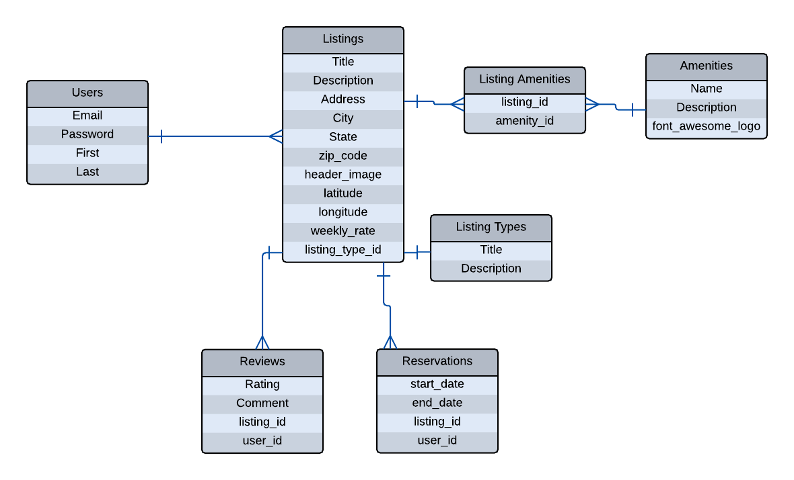
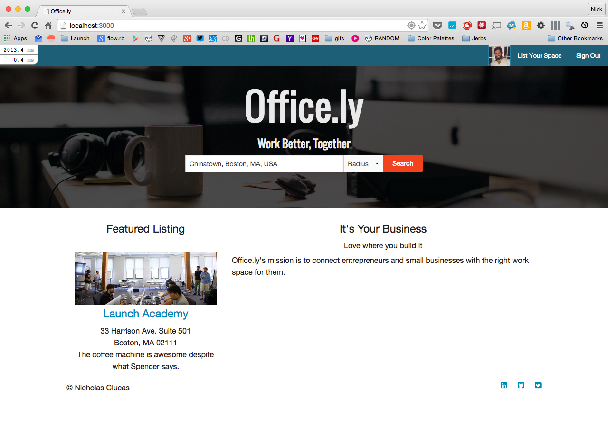

#  Office.ly

#####  Officely is an Airbnb clone for office spaces. It allows companies to list any open desks or cubicles they have available for short or long-term rental.

In my last job, we had a huge office, but about **one quarter** of it went unused. I wanted to build a solution to help both the host office and small businesses connect to fill that empty space.

##### ER Diagram:

##### Screenshots:

##### Status:

